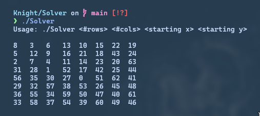

# Knight
Some programs I made for university.
# Distance calculator
This program calculates the minimum steps required to reach a certain cell from some given starting cell. You need to have SDL2 and SDL2ttf installed to compile it.
For example, the steps required to get from the top left corner to every other cell in the standard board looks like this:

Idk, I think it looks awesome.

_Usage: #rows #cols start_x start_y_

# Solver
This program tries to solve the  for a given board size and starting cell using a backtracking algorithm. Some starting positions take a looot of time, some are actually imposible to solve, but running the program without parameters, solves an example in a somewhat short amount of time.

_Usage: #rows #cols start_x start_y_

